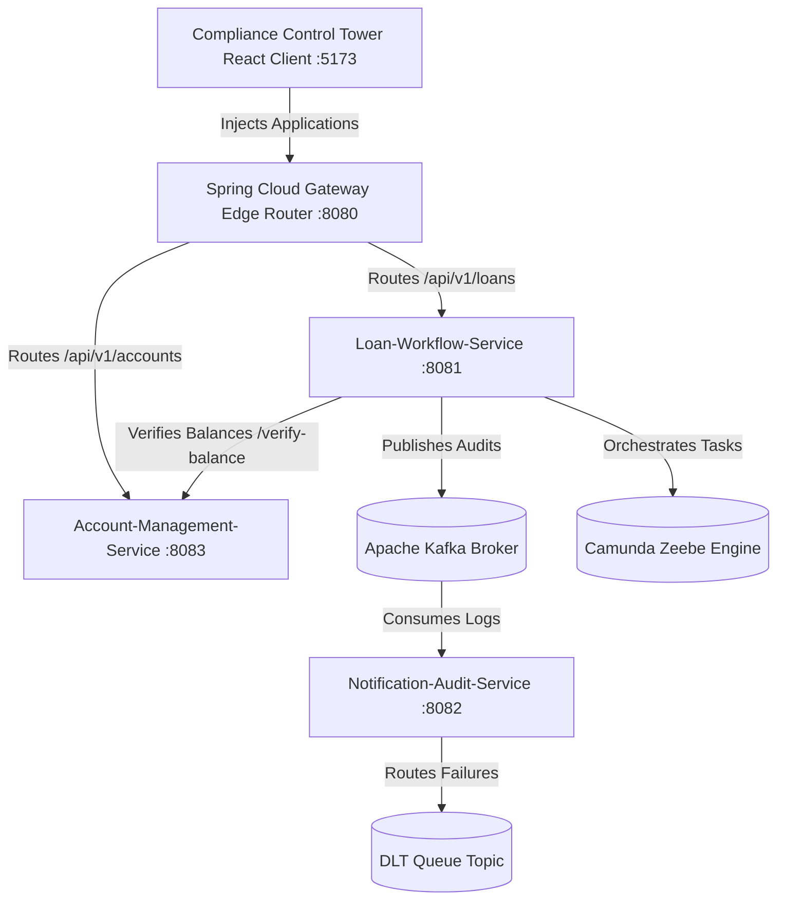

# FinStream - Enterprise Banking & Loan Platform

FinStream is a reference implementation of a resilient, event-driven core banking microservices backend and administrative control panel. It demonstrates production-ready enterprise integration patterns (EIP), workflow orchestration, and fault-tolerant telemetry.

---

## 1. System Architecture



---

## 2. Microservices Directory

* **`api-gateway`**: Exposes port `8080`, routing external requests down to backing modules.
* **`account-management-service`**: Exposes port `8083`, managing account balances and KYC status (PostgreSQL).
* **`loan-workflow-service`**: Exposes port `8081`, embedding Camunda 8 (Zeebe), executing credit Bureau calls protected by Resilience4j Circuit Breakers, and publishing transaction events to Kafka.
* **`notification-audit-service`**: Exposes port `8082`, consuming transactional streams from Kafka and routing exceptions to a Dead Letter Queue (DLQ).
* **`compliance-control-tower`**: Vite + React + TypeScript + Tailwind CSS v4 administrative dashboard client.

---

## 3. Tech Stack

* **Backend**: Java 21, Spring Boot 3.3.x (Spring Web, Spring Data JPA, Spring AOP), Camunda 8 Zeebe, Spring Kafka, Resilience4j, Maven
* **Frontend**: React.js, TypeScript, Tailwind CSS v4, Vite, Lucide React
* **Databases & Infrastructure**: PostgreSQL 16, Apache Kafka, Elasticsearch, Zookeeper, Docker Compose

---

## 4. Run Guide

### Prerequisites
* Java JDK 21
* Maven 3.9+
* Node.js 18+ & npm
* Docker Desktop

### Step 1: Spin Up Infrastructure
Standing up PostgreSQL, Kafka brokers, and Zeebe containers from root:
```bash
docker compose up -d
```

### Step 2: Compile & Run Backend Services
Build all submodules simultaneously from the parent directory:
```bash
# Compile and run unit tests
mvn clean test

# Package JARs
mvn clean package -DskipTests
```
Execute each Spring Boot microservice module locally:
```bash
# Terminal 1: Account Service
cd account-management-service && mvn spring-boot:run

# Terminal 2: Loan Service
cd loan-workflow-service && mvn spring-boot:run

# Terminal 3: Audit Service
cd notification-audit-service && mvn spring-boot:run

# Terminal 4: API Gateway Router
cd api-gateway && mvn spring-boot:run
```

### Step 3: Run the Dashboard UI
```bash
cd compliance-control-tower
npm install
npm run dev
```
Navigate to **[http://localhost:5173/](http://localhost:5173/)** (or port `5174` if `5173` is occupied) in your browser.

---

## 5. Resiliency Scenarios to Test

### Scenario A: Resilience4j Circuit Breaker Trip
1. Open the dashboard. Observe the Circuit Breaker telemetry indicator is **`CLOSED`** (healthy).
2. Inject a new transaction. The system queries the external Bureau API and completes successfully.
3. Toggle the **"Simulate Circuit Failover"** switch on the dashboard to degrade downstream service health.
4. The Circuit Breaker badge will trip to **`OPEN - FAILOVER ACTIVE`**.
5. Submit a new application. The service immediately intercepts the call and runs the fallback scorer, defaulting the applicant's rating safely to **`600`** to prevent risk leakage.

### Scenario B: Kafka Dead Letter Queue (DLQ) Recovery
1. In the simulator panel, input the customer Account ID value as `"poison-pill"`.
2. Submit the transaction. 
3. The serializer aspect intercepts this value and throws parsing exceptions.
4. Instead of blocking the processing threads, the `notification-audit-service` Kafka handler isolates the payload and routes it directly to the `"loan-audit-stream.DLT"` topic, committing the offset safely.
